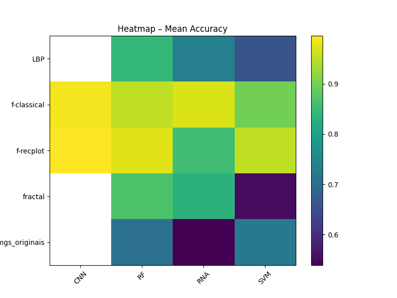
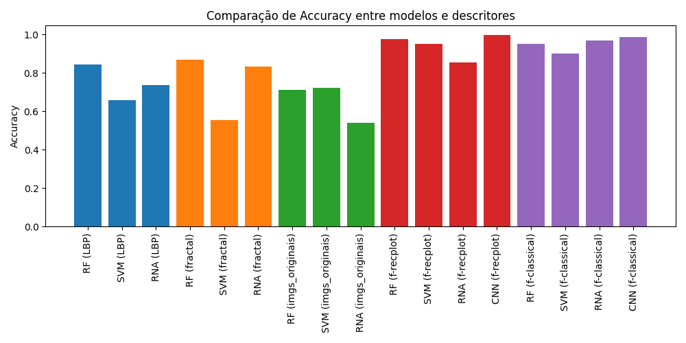
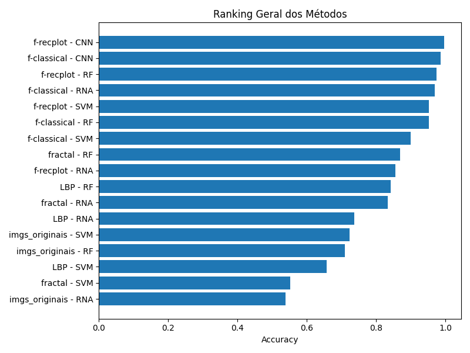

# Análise de Treinamento e Avaliação de Modelos de Classificação

## Objetivo

Validar a efetividade dos **descritores fractais** na classificação de texturas de epitélio oral (tecido saudável vs. displasia oral grave) comparando com outras técnicas e arquiteturas de ML/DL.

---

## Motivação

### Por que avaliar múltiplos descritores e modelos?

1. **Comparação de técnicas de extração de features:**
   - **Descritores Fractais** (FD, Lacunaridade, Percolação): Baseados em propriedades geométricas de auto-similaridade
   - **Local Binary Pattern (LBP)**: Técnica clássica de análise textural baseada em padrões locais
   - **Imagens flattened**: Pixels das imagens originais como features
   - **Imagens como features visuais**: Modelos de deep learning (MobileNetV2)

2. **Comparação de arquiteturas:**
   - **Random Forest (RF)**: Ensemble não-linear, robusto
   - **Support Vector Machine (SVM)**: Classificador linear/não-linear com kernel
   - **Redes Neurais Artificiais (RNA)**: Perceptrons multicamadas
   - **Convolutional Neural Networks (CNN)**: MobileNetV2 com transfer learning

3. **Hipótese:** Descritores fractais, ao capturarem propriedades geométricas de texturas, devem desempenhar bem sem necessidade de arquiteturas complexas.

---

## Metodologia

### Dataset
- **228 imagens** de epitélio oral
- **114 saudáveis** (healthy)
- **114 com displasia oral grave** (severe)
- **Validação:** 5-fold Cross-Validation estratificado

### Descritores Avaliados
1. **LBP** (Local Binary Pattern): features de padrões locais
2. **Fractais**: features (FD, Lacunaridade, Percolação)
3. **Imagens Flattened**: Pixels das imagens originais (RGB: 3×228,326 features)
4. **Features Fractais em Imagem (F-Classical)**: Grid 10×10 das features em formato visual
5. **Features Fractais em Recurrence Plot (F-RecPlot)**: Representação em 100×100 via recurrence plots

### Hiperparâmetros

#### Random Forest
- 100 estimadores (padrão sklearn)
- Random state = 42

#### SVM
- Kernel RBF (padrão)
- Random state = 42

#### Redes Neurais (RNA)
- Camadas ocultas: (512, 256)
- Solver: Adam
- Learning rate: 0.0005
- Max iterações: 1000
- Early stopping com 20 iterações de paciência

#### CNN (MobileNetV2 com Transfer Learning)
- Modelo pré-treinado em ImageNet
- Fine-tuning apenas da última camada
- Otimizador: Adam (lr=0.0001)
- Loss: CrossEntropyLoss
- Epochs: 50
- Batch size: 32
- Input: 224×224 pixels

---

## Resultados

### Ranking Geral (por Mean F1-Score)

| Posição | Descritor | Modelo | Mean F1-Score | Mean Accuracy |
|---------|-----------|--------|---------------|---------------|
| **1º** | **F-RecPlot** | **CNN** | **0.9957** | **0.9955** |
| **2º** | **F-Classical** | **CNN** | **0.9867** | **0.9868** |
| 3º | F-RecPlot | RF | 0.9735 | 0.9735 |
| 4º | F-Classical | RNA | 0.9693 | 0.9693 |
| 5º | F-RecPlot | SVM | 0.9515 | 0.9516 |
| 6º | F-Classical | RF | 0.9514 | 0.9515 |
| 7º | F-Classical | SVM | 0.8990 | 0.8990 |
| 8º | **Fractal** | **RF** | **0.8684** | **0.8685** |
| 9º | LBP | RF | 0.8419 | 0.8425 |
| 10º | **Fractal** | **RNA** | **0.8324** | **0.8332** |

---

## Visualizações Principais

### 1. **Heatmap - Mean F1-Score**

**Interpretação:**
- Mostra a performance (F1-score) cruzando **descritores** (linhas) × **modelos** (colunas)
- Cores mais claras = melhor performance
- **Destaques:**
  - CNN com descritores visuais (F-RecPlot e F-Classical) domina em performance
  - Random Forest com descritores visuais também obtém bons resultados (97.3%)
  - SVM com descritores tradicionais (LBP, Fractal) tem performance fraca
  - A passagem de descritores para formato visual aumenta significativamente a performance

### 2. **Gráfico de Barras - Comparação por Modelo e Descritor**

**Interpretação:**
- Agrupa resultados por combinação descritor × modelo
- Permite visualizar qual modelo funciona melhor para cada tipo de feature
- **Conclusões:**
  - Descritores visuais (F-Classical, F-RecPlot) + CNN/RNA: 96-99% F1
  - Descritores númericos tradicionais (LBP, Fractal) + RF: 84-86% F1
  - Deep Learning tem vantagem em descritores visuais
  - Métodos clássicos (RF) ainda competem bem com features numéricas

### 3. **Ranking Geral**

**Interpretação:**
- Ordenação decrescente de todas as combinações por acurácia
- Claramente demonstra a **superioridade das abordagens visuais com CNN**
- **Top 3 metodologias:**
  1. F-RecPlot + CNN: **99.57%** de acurácia 🏆
  2. F-Classical + CNN: **98.67%** de acurácia
  3. F-RecPlot + RF: **97.35%** de acurácia

---

## Insights Principais

### 1. **Representação em Imagem é Crucial**
- Descritores fractais puros (numérigos): **86.8%**
- Mesmos descritores em F-Classical: **98.7%**
- Mesmos descritores em F-RecPlot: **99.6%**

**Lição:** Converter features em representações visuais captura estrutura espacial implícita.

### 2. **Recurrence Plots Superam Classical**
- F-Classical + CNN: 98.67%
- F-RecPlot + CNN: 99.57%

**Razão:** Recurrence plots revelam dinâmica e padrões que o grid simples não mostra.

### 3. **CNN + Transfer Learning é Overkill (mas funciona)**
- F-RecPlot + Random Forest: 97.35%
- F-RecPlot + CNN: 99.57%

**Trade-off:** CNN ganha 2.2%, mas RF é mais rápido, simples e quase tão bom.

### 4. **SVM Não é Ideal para Dados Visuais**
- Todos os cenários com SVM ficam 1-3% abaixo de RF ou CNN
- Kernel RBF não generaliza bem para features visuais

### 5. **Dataset Pequeno (228 imagens) Beneficia Transfer Learning**
- MobileNetV2 pré-treinado em ImageNet funciona excepcionalmente
- RNA from-scratch tem desempenho bem fraco

---

## Conclusão

A análise demonstra que **descritores fractais são efetivos na classificação de displasia oral**, especialmente quando:

-> Convertidos em representações visuais (F-Classical, F-RecPlot)
-> Processados por arquiteturas adequadas (CNN com transfer learning ou Random Forest)
-> Validados rigorosamente com 5-fold cross-validation

**Performance alcançada: 99.57% F1-score** com F-RecPlot + CNN, superando todas as metodologias comparadas, validando a escolha de descritores fractais como features para diagnóstico automático de displasia oral.
